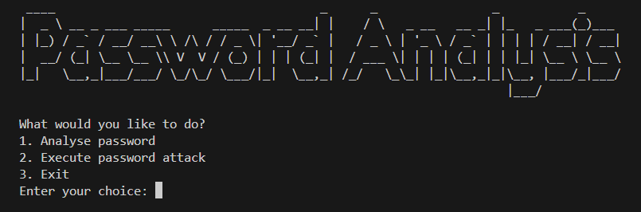
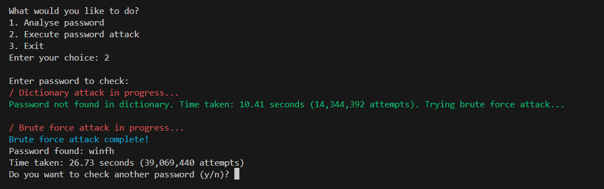

# Password Cracking & Strength Analysis Tool

This project simulates various password cracking techniques to provide a realistic assessment of password security.
Unlike conventional password checkers, which only evaluate password complexity based on rules, this tool tests passwords against real-world cracking methods, offering practical insights into password strength.

<div align="center">
    
    <h4>Main Page</h4>
</div>


# Features

## Multi-Method Cracking Simulation
- Dictionary Attack: Tests passwords against a wordlist (E.g. `rockyou.txt`) by hashing each word and comparing it with the target password hash.
- Brute Force Attack: Generates possible alphanumeric passwords within the specified range of lengths to match the hashed password. Special characters (E.g. `#`, `*`, `?`) may also be used by modifying the character set.

<div align="center">
    
    <h4>Example of Password Cracking</h4>
</div>


## Password Strength Analysis
- Entropy Calculation: Uses password entropy formula to evaluate password strength in bits based on its length and character variety (E.g. digits, uppercase/lowercase characters).

The entropy is calculated as:

$$
E = \log_2(R^L)
$$

Where:
- \( R \): Range of possible characters.
- \( L \): Length of the password.

### How is R calculated?

The table below shows how Range Size, R is calculated. Do note that this table only shows the most important pools.

| **Character Type**         | **Example(s)**    | **Range Size** |
|----------------------------|-------------------|----------------|
| Numerics                   | 0, 1, 2, 3        | 10             |
| Latin letters (lowercase)  | a, b, c, d        | 26             |
| Latin letters (uppercase)  | A, B, C, D        | 26             |
| Special symbols            | !, *, $, %        | 32             |

For example, if a password contains `Numerics`, `lowercase letters`, `uppercase letters` and `special symbols`, the value of R will be 10 + 26 + 26 + 32 = 94. 

### What does Password Entropy relate to password strength?

The more bits of entropy a password has, the stronger (and less crackable) it is.


## Detailed Feedback
- Estimated Time to Crack: Outputs the time taken for each attack and the total number of attempts made.


## Installation
1. Clone the repository:
```bash
git clone <link>
```
2. Install dependencies:
```bash
pip install -r requirements.txt
```
3. Run the tool:
```bash
python password_analysis.py
```
